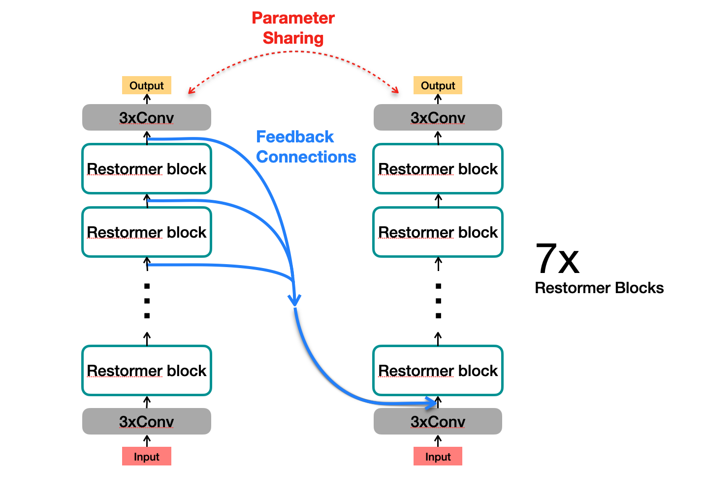
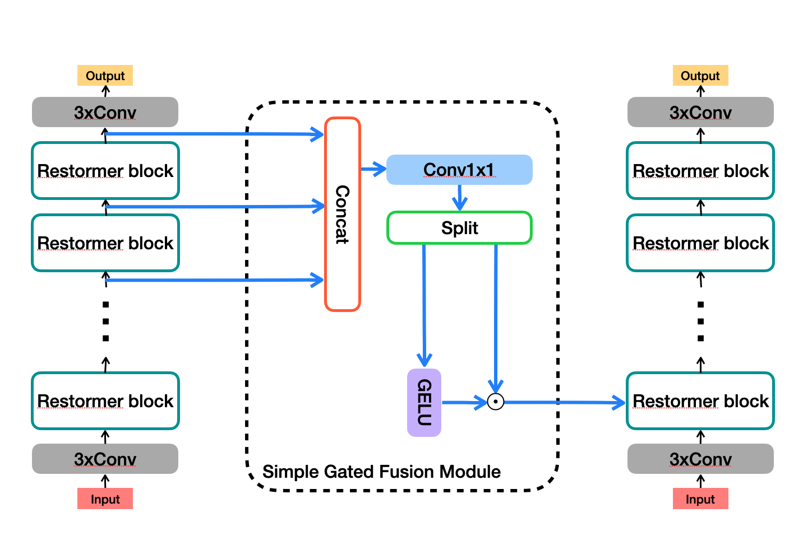

# MegCup 2022 Team Feedforward

> This repository is the official [MegEngine](https://www.megengine.org.cn/) implementation of the 3rd place solution (Team Feedforward) in [2022 MegCup RAW image denoising](https://studio.brainpp.com/competition/5?tab=rank).

- [MegCup 2022 Team Feedforward](#megcup-2022-team-feedforward)
  - [Method](#method)
  - [Environment](#environment)
    - [Conda](#conda)
    - [Docker](#docker)
  - [Usage](#usage)
  - [Members](#members)
  - [Acknowledgement](#acknowledgement)

## Method
We propose a **F**eed**B**ack-based **Restormer** (**FBRestormer**) for lightweight denoising, the number of parameters in this model is smaller than **100K**!

</img> </img>

Notice That, the restormer blocks in our architecture are modified by replacing the depth-wise 3x3 convlution in the GDFN with depth-wise 5x5 convlution which is also dilated with dilation equals 2.

The simple gated fusion module is used for feedback connections.

## Environment

### Conda

```shell
$ conda create -f ./env.yaml
$ conda activate megcup
```

### Docker

<font color=red>TBD</font>

## Usage

```shell
$ python test.py --data-path DATA_PATH      # The test input data path.
                 --checkpoint CHEKPOINT     # The checkpoint need to be loaded.
                [--batch-size BATCH_SIZE]   # OPTIONAL: Batch size for the dataloader,            DEFAULT: 1
                [--num-workers NUM_WORKERS] # OPTIONAL: Number of workers for the dataloader,     DEFAULT: 0
                [--output PATH]             # OPTIONAL: The path to output the final binary file, DEFAULT: '.'
```

Example:
```shell
$ cp PATH/DATA .
$ python test.py --data-path ./DATA --checkpoint ./feedback_restormer.mge
```

## Members

- [Xin Jin](https://github.com/Srameo)
- [Rui-Qi Wu](https://github.com/RQ-Wu)
- [Zhen Li](https://github.com/Paper99) \[[Homepage](https://paper99.github.io/)\]
- [Chongyi Li](https://github.com/Li-Chongyi) (Supervisior) \[[Homepage](https://li-chongyi.github.io/)\]

## Acknowledgement
This project is based on [Restormer](https://github.com/swz30/Restormer), [SRFBN](https://github.com/Paper99/SRFBN_CVPR19), and [GMFN](https://github.com/liqilei/GMFN).
